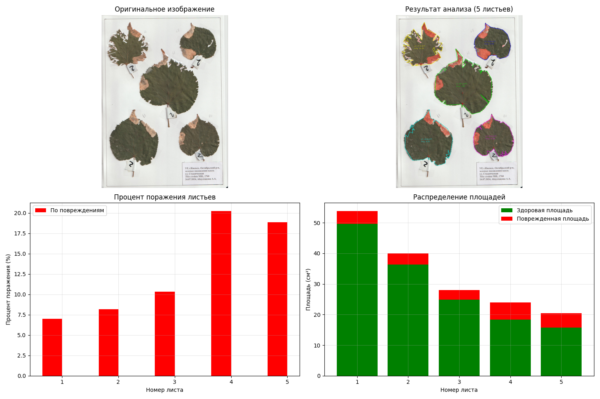

# Проект по распознаванию плотности (процента) поражения листьев деревьев.
## Реализация на языке Python с использованием библиотеки OpenCV.

### Содержание:
1. requirements.txt (Файл с библиотеками);
2. README.md (Основная информация);
3. .gitignore (Файл для исключения системозависимых данных);
4. v0.3 (Исполняемая программа);

Пример изображений датасета:

Результат работы программы версии v0.3:

