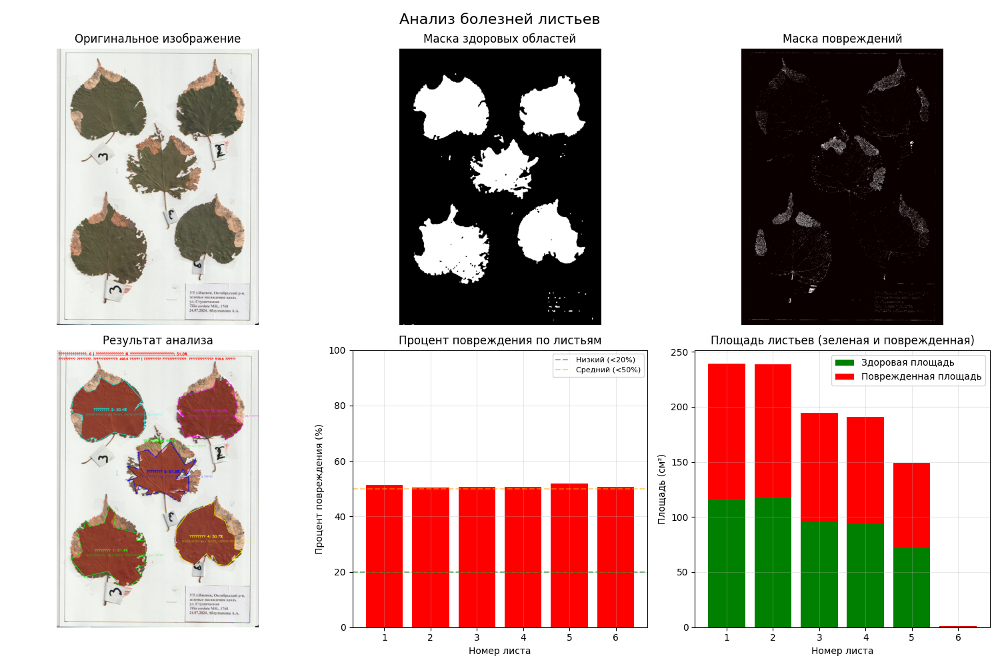

# Проект по распознаванию плотнности (процента) порожения листьев деревьев.
## Реализация на языке python с использованием библиотеки OpenCV.

### Содержание:
1. requirements.txt (Файл с библиотеками);
2. README.md (Основная информация)
3. .gitignore (Файл для исключения системозависимых данных)
4. Файл проека (Замените на имя вашео фала исполняемой программы)

Пример изображений датасета:

